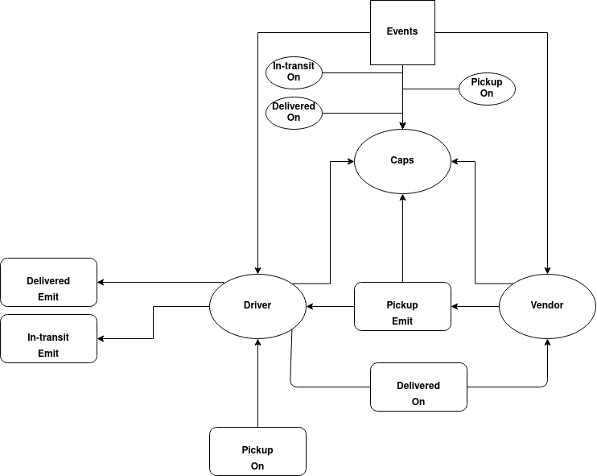

# CAPS

## About

An application that uses events and event handlers to pickup anbd dileveries for vendors:

### Vendors

1. Vendors wants to alert the system when they have a package to be picked up.
2. Vendor wants to be notified when their packages get delivered.

### Drivers

1. Drivers wants to be notified when there is a package to be delivered.
2. Drivers wants to alert the system when they have picked up a package and it is in transit.
3. Drivers wants to alert the system when a package has get delivered.

<hr>

## Author

#### Amjad Mesmar

<hr>

## Links

- [Repo](https://github.com/AmjadMesmar/CAPS)

- [Submission Pull Request](https://github.com/AmjadMesmar/CAPS/pull/1)

- [Action Report](https://github.com/AmjadMesmar/CAPS/actions)

<hr>

## Setup

### Install the following dependencies

```

  "devDependencies": {
    "jest": "^27.0.3",
    "supertest": "^6.1.3"
  },
  "dependencies": {
    "faker": "^5.5.3"
  }

```

<br>

## Running the app

1. Clone the repository.
2. Go to the repository's root directory.
3. Enter the command `node caps.js`
4. Read console logs.

<br>

## Events

### `Pickup`

```

-----------------------------------------------------------------------
EVENT { event: 'pickup',
{ time:
   'Mon May 31 2021 16:16:11 GMT+0300 (Eastern European Summer Time)',
  payload:
   { store: 'Ledner - O\'Reilly Paradigm',
     orderID: '31c393c7-cce0-4502-87c5-f3e06830c0d5',
     customer: 'Mr. Craig Considine',
     address: 'Erdman Fords,Wilmington' } }
DRIVER: picked up 31c393c7-cce0-4502-87c5-f3e06830c0d5

```

### `In-transit`

```

EVENT { event: 'in-transit',
{ time:
   'Mon May 31 2021 16:16:11 GMT+0300 (Eastern European Summer Time)',
  payload:
   { store: 'Ledner - O\'Reilly Paradigm',
     orderID: '31c393c7-cce0-4502-87c5-f3e06830c0d5',
     customer: 'Mr. Craig Considine',
     address: 'Erdman Fords,Wilmington' } }

```

### `Delivered`

<br>

```

Driver: delivered 31c393c7-cce0-4502-87c5-f3e06830c0d5
Ledner - O'Reilly Paradigm: Thank you for delivering 31c393c7-cce0-4502-87c5-f3e06830c0d5
EVENT { event: 'delivered',
{ time:
   'Mon May 31 2021 16:16:11 GMT+0300 (Eastern European Summer Time)',
  payload:
   { store: 'Ledner - O\'Reilly Paradigm',
     orderID: '31c393c7-cce0-4502-87c5-f3e06830c0d5',
     customer: 'Mr. Craig Considine',
     address: 'Erdman Fords,Wilmington' } }
-----------------------------------------------------------------------

```

## Test

- To test the server write in terminal:

```
npm test
```

<br><br><br>

<hr>

<br><br>

## UML Diagram



